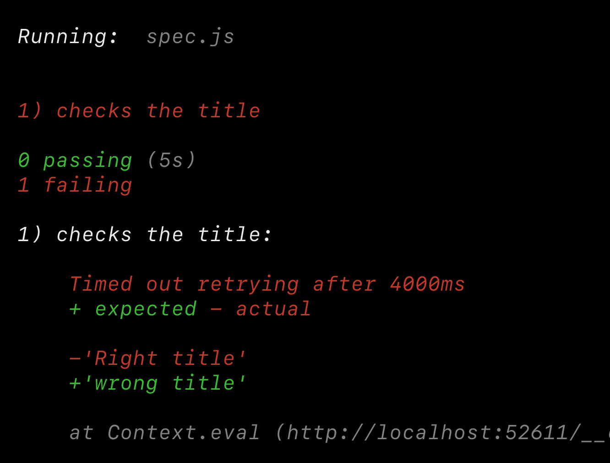
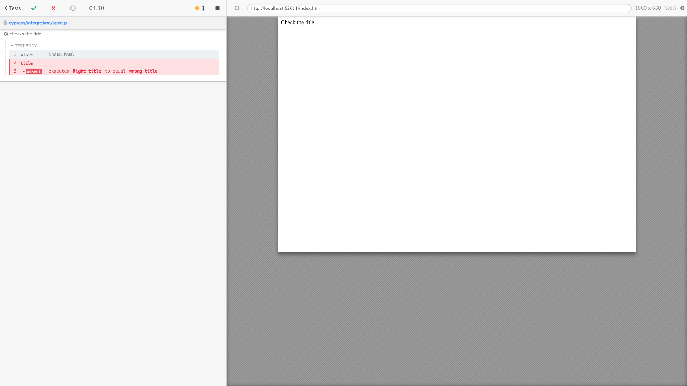

Checking [cy.title](https://on.cypress.io/title)

See [cypress/integration/spec.js](./cypress/integration/spec.js)

When running with `npx cypress run` the terminal shows the error message

The saved screenshot also shows the error clearly

